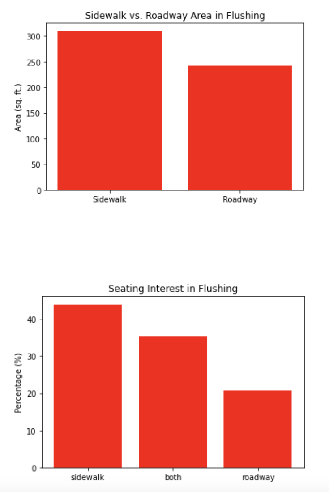

Flushing: A Neighborhood Analysis

Highlighted Map:

Statistics:

Population: 72,008

Population Density: 84.4 citizens per acre (~4047 m.^2)

Median Age: 46.9 years

Sex: 53% Female, 47% Male

Ethnicity: 69.2% Asian, 14.9% Hispanic/Latino, 9.5% White, 4.2% African American, 2.2% Other

Common Languages: English, Mandarin, Taiwanese, Cantonese, Spanish, Korean

Conclusions from HC3

Unfortunately, Flushing rated poorest among tested Queens neighborhoods. Although with respect to the quality of the neighborhood Flushing received a Niche score of B, a score which was rather on par with what other neighborhoods - such as Maspeth and Jackson Heights - reported, other websites took to Flushing less favorably. Street Advisor assigned Flushing a rating of 5.7, higher only than Jackson Heights according to that site, while DNAInfo Rank dispensed the comparatively abysmal score of 9 for Flushing based on their data. Our group applied three metrics which pointed towards the same ultimate conclusion for Flushing, those being Walk and Transit score (separately) as well as Income. Altogether, this pointed towards Flushing being the least desirable neighborhood among those tested for outdoor dining.

Data Analysis from Open Restaurant Apps.

Map of Flushing Restaurant Apps.

